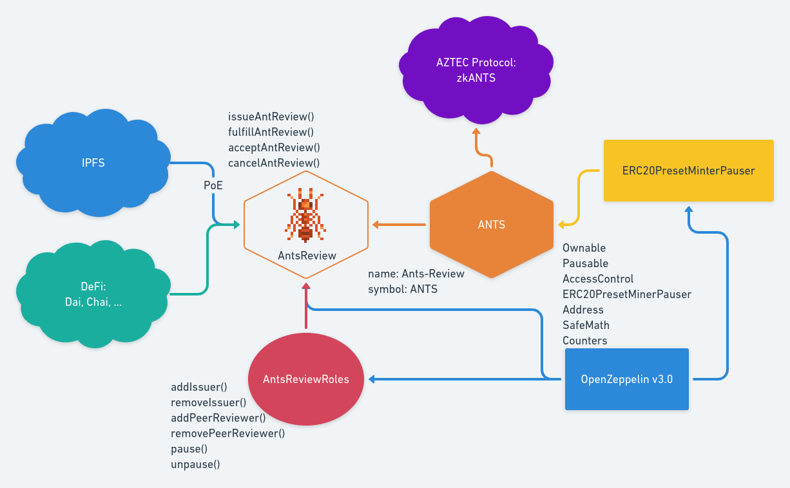

[](https://ubuntu.com/download/desktop)
[](https://github.com/nvm-sh/nvm#installation-and-update)
[](https://www.trufflesuite.com/)
[](https://github.com/ethereum/solidity/releases/tag/v0.6.12)
[](#project-mvp-deployed-on-kovan)
[](https://rinkeby.etherscan.io/address/0x6956dF88120c44fb446761947cD4B83b553F229F)


[](https://ethlocal.co/ethturin/hacks)
[](https://zenodo.org/badge/latestdoi/258342275)  


# Ants-Review
> A Protocol for Open Anonymous Scientific Peer-Reviews on Ethereum  
> :1st_place_medal: 1st Place at [ETHTurin Hackathon](https://ethlocal.co/ethturin/hacks)

The Project implements a Bounty-like protocol called Ants-Review to allow issuers to issue an AntReview, a bounty for peer-review in scientific publication, linked to requirements stored on ipfs which peer-reviewers can fufill by submitting the ipfs hash which contains evidence of their fufillment.  
After the submission of successful peer-reviews, they will be approved by an approver and payed in ANTS.  

Project (MVP) feautures:
- ERC20 token, name: Ants-Review, symbol: ANTS.
- ANTS Faucet on Kovan.
- IPFS Hash Timestamped on Ethereum via PoE (Proof of Existence).
- Storing on IPFS.

Future integrations & features:

- Quadratic Funding Gitcoin-like for Ants-Review.
- zkANTS, allowing private Ants transactions on Ethereum using ZK-SNARKs via AZTEC Protocol.
- De-Fi services like Dai, Chai, MakerDAO DSR, ...
- ENS, allowing human-readable Ethereum addresses
- Quadratic Funding Gitcoin-like for Ants-Review.
- Upgradability, to allow the logic to be extended and improved.
- ...

[White Paper](https://zenodo.org/record/3828087#.Xr8XVXVKg5k)  
[Presentation](https://zenodo.org/record/3828067#.Xr8Pv3VKg5k)  
[Demo (PoC)](https://youtu.be/uMqksNytsMY)  

## Sections
* [Building Blocks](#building-blocks)
* [Setup](#setup)
* [Deploy](#deploy)
* [Using the DApp](#using-the-dapp)
* [Interacting with the PoC](#interacting-with-the-poc)
* [About](#about)

Building Blocks
===============



### [AntsReview](./contracts/AntsReview.sol)
> AntsReview a bounty-like system for scientific peer-reviews rewarded in ANTS

### [AntsReviewRoles](./contracts/AntsReviewRoles.sol)
> AntsReviewRoles Access Management for Default Admin, Issuer, Peer-Reviewer and Pauser Role

### [ANTS](./contracts/ANTS.sol)
> ANTS Ants-Review's native token

### [AntsFaucet](./contracts/AntsFaucet.sol)
> AntsFaucet ANTS Faucet


Setup
=====

Clone this GitHub repository.

## Steps to compile and deploy

  - Local dependencies:
    - Truffle
    - Ganache CLI
    - OpenZeppelin Library v3.0
    - Truffle HD Wallet Provider
    - Truffle Flattener
    ```sh
    $ npm i
    ```
 - Global dependencies:
    - Truffle (recommended):
    ```
    npm install -g truffle
    ```
    - Ganache CLI (recommended):
    ```
    npm install -g ganache-cli
    ```
    - Slither (optional):
    ```sh
    pip3 install slither-analyzer
    ```
    - MythX CLI (optional):

    ```sh
     $ git clone git://github.com/dmuhs/mythx-cli
     $ sudo python setup.py install
     ```
## Running the project with local test network (ganache-cli)

   - Start ganache-cli with the following command (global dependency):
     ```sh
     $ ganache-cli
     ```
   - Compile the smart contract using Truffle with the following command (global dependency):
     ```sh
     $ truffle compile
     ```
   - Deploy the smart contracts using Truffle & Ganache with the following command (global dependency):
     ```sh
     $ truffle migrate
     ```
   - Test the smart contracts using Mocha & OpenZeppelin Test Environment with the following command:
     ```sh
     $ npm test
     ```
   - Analyze the smart contracts using Slither with the following command (optional):
      ```sh
      $ slither .
      ```
   - Analyze the smart contracts using MythX CLI with the following command (optional):
     ```sh
     $ mythx analyze    
     ```
Deploy
======
## Deploying on Kovan's Testnet
  - Get an Ethereum Account on Metamask.
  - On the landing page, click “Get Chrome Extension.”
  - Create a .secret file cointaining the menomic.
  - Get some test ether from a [Kovan's faucet](https://faucet.kovan.network/).
  - Signup [Infura](https://infura.io/).
  - Create new project.
  - Copy the kovan URL into truffle-config.js.
  - Uncomment the following lines in truffle-config.js:
    ```
    // const HDWalletProvider = require("@truffle/hdwallet-provider");
    // const infuraKey = '...';
    // const infuraURL = 'https://rinkeby.infura.io/...';

    // const fs = require('fs');
    // const mnemonic = fs.readFileSync(".secret").toString().trim();
    ```
  - Install Truffle HD Wallet Provider:
    ```sh
    $ npm install @truffle/hdwallet-provider
    ```
  - Deploy the smart contract using Truffle & Infura with the following command:
    ```sh
    $ truffle migrate --network kovan
    ```
 ## Project (PoC) deployed on Rinkeby
 [AntsReview.sol](https://rinkeby.etherscan.io/address/0x6956dF88120c44fb446761947cD4B83b553F229F)  
 
 ## Project (MVP) deployed on Kovan  
 [AntsReview.sol](https://kovan.etherscan.io/address/)  
 [ANTS.sol](https://kovan.etherscan.io/address/)  
 [AntsFaucet.sol](https://kovan.etherscan.io/address/)

 Using the DApp
 ==============
  - Install [Ganache GUI](https://www.trufflesuite.com/ganache).
  - Change Ganache GUI port to 8545.
  - Import Ganache GUI mnemonic into MetaMask.
  - Connect MetaMask to Ganache GUI, adding a custom RPC specifing the Ganache GUI's RPC server URL.
  - Deploy the smart contracts to Ganache GUI:
    ```sh
    $ truffle migrate
    ```
  - Move to client directory on the project:
    ```sh
    $ cd client
    ```
  - Install dependencies:
    ```sh
    $ yarn install
    ```
  - Start the Local Web Server:
    ```sh
    $ npm run start
    ```  
 The DApp (PoC) has been deployed on IPFS via [Fleek](https://fleek.co/): https://antsreview.on.fleek.co

Interacting with the PoC:
=========================

  - The User (Author) can issue a new AntReview, specifying:
    - IPFS Hash of requirements (e.g. QmaozNR7DZHQK1ZcU9p7QdrshMvXqWK6gpu5rmrkPdT3L4);
    - Timestamp of the deadline ([timestamp generator](https://www.unixtimestamp.com/));
    - Ether value of the AntReview reward (e.g. 1 ETH);
  - Switch Account on MetaMask (Peer-Reviewer) and Refresh the DApp.
  - Fulfill the AntReview by specifying the AntReview Id and the IPFS Hash of the peer-review.
  - Switch Account on MetaMask to the Issuer (Author) and Refresh the DApp.
  - Accept the Fulfillment (Peer-Review) by specifying the AntReview Id and Peer-Review Id.
  - The Peer-Reviewer Account will get the reward for the AntReview.
  - Switch Account on MetaMask to the Issuer (Author) and Refresh the DApp.
  - Cancel AntReview by specifying the AntReview Id (to be used after the deadline, if the AntReview has not received any fulfillments)
  - The Issuer will get back the reward of the AntReview Id specified.
  - Done.  

About
=====
## Inspiration & References

[](https://github.com/naszam/awesome-antsreview/blob/master/README.md#references)


## Authors
Project created by Team MetaBounty for ETHTurin 2020 Hackathon.  
Research and Design by [Bianca Trovò](https://www.linkedin.com/in/bianca-m-trovo/)  
Smart Contracts and Architecture by [Nazzareno Massari](http://nazzarenomassari.com)  
Pixel Art by [Marcelo Colmenero](https://www.instagram.com/isometricpixelart/?hl=en)  
